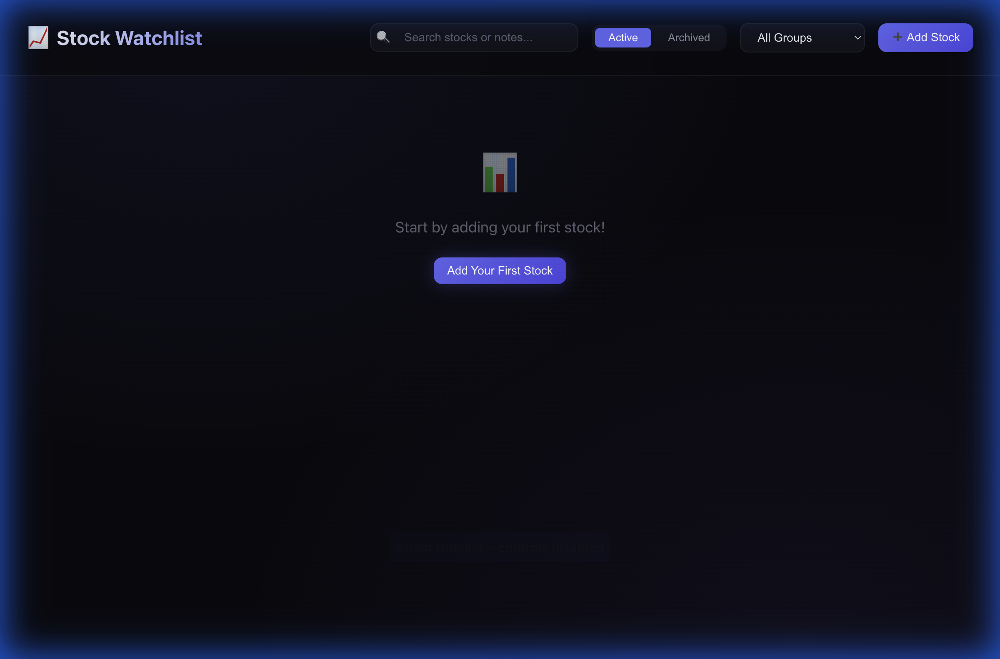

# 📈 Stock Watchlist

A modern, self-hosted stock watchlist application with embedded TradingView charts, personal notes, and stock grouping capabilities.



## ✨ Features

- 📊 **TradingView Charts** - Live embedded charts for each stock
- 📝 **Personal Notes** - Add notes to any stock (auto-saves)
- 🏷️ **Smart Grouping** - Organize stocks by strategy (Swing Trade, Long Holding, etc.)
- 📦 **Archive** - Hide stocks without deleting them
- 🔍 **Search** - Quickly find stocks or notes
- 📺 **Fullscreen Mode** - Expand any chart for detailed analysis
- 📱 **Mobile Friendly** - Access from your phone on the same network
- 💾 **Local Database** - All data stored locally in SQLite

## 🚀 Quick Start

### Prerequisites

- **Node.js** v18+ ([Download](https://nodejs.org))

### Installation

```bash
# Clone the repository
git clone https://github.com/YOUR_USERNAME/stock-watchlist.git
cd stock-watchlist

# Install dependencies
npm install

# Start the application
npm run dev
```

The app will be available at:
- 💻 **Local:** http://localhost:5173
- 📱 **Network:** http://YOUR_IP:5173 (for mobile access)

## 📖 Usage

### Adding a Stock

1. Click **"Add Stock"** button
2. Select the exchange (NSE, BSE, NASDAQ, NYSE, Binance)
3. Enter the stock symbol (e.g., RELIANCE, TCS, AAPL)
4. Enter the company name
5. Optionally select a group
6. Click **"Add Stock"**

### Managing Stocks

| Action | How To |
|--------|--------|
| **Add Note** | Click the notes area below the chart and type |
| **Change Group** | Use the dropdown in the stock card header |
| **Fullscreen** | Click the expand icon (⛶) |
| **Archive** | Click the box icon (📦) |
| **Delete** | Click the trash icon (🗑️) |

### Groups

Pre-configured groups for organizing your stocks:

| Group | Purpose |
|-------|---------|
| 📌 Watchlist | General watchlist |
| 🟢 Swing Trade | Short-term swing trades |
| 🔵 Long Holding | Long-term investments |
| 🟠 Short Term | Quick trades |
| 🔴 High Risk | High-risk positions |

## 🛠️ Tech Stack

| Component | Technology |
|-----------|------------|
| Frontend | React 19 + Vite |
| Styling | Vanilla CSS (Dark Theme) |
| Charts | TradingView Widget API |
| Backend | Express.js |
| Database | SQLite (better-sqlite3) |

## 📁 Project Structure

```
stock-watchlist/
├── server/
│   ├── database.js     # SQLite database setup
│   ├── index.js        # Express API server
│   └── stocks.db       # Database file (auto-created)
├── src/
│   ├── App.jsx         # Main application
│   ├── index.css       # Styles
│   └── components/
│       ├── StockCard.jsx
│       ├── TradingViewWidget.jsx
│       ├── AddStockModal.jsx
│       └── FullscreenModal.jsx
├── docs/
│   └── screenshots/
├── package.json
└── README.md
```

## 🔧 Configuration

### Changing the Port

Edit `server/index.js`:
```javascript
const PORT = 3001; // Change this
```

Edit `package.json` for Vite port:
```json
"client": "vite --host --port 5173"
```

### Adding Custom Groups

The default groups are created in `server/database.js`. You can modify them there or add new groups through the API.

## 📡 API Endpoints

| Method | Endpoint | Description |
|--------|----------|-------------|
| GET | `/api/stocks` | Get all stocks |
| POST | `/api/stocks` | Add a new stock |
| PUT | `/api/stocks/:id` | Update a stock |
| DELETE | `/api/stocks/:id` | Delete a stock |
| POST | `/api/stocks/:id/archive` | Archive a stock |
| POST | `/api/stocks/:id/unarchive` | Unarchive a stock |
| GET | `/api/groups` | Get all groups |
| POST | `/api/groups` | Create a new group |
| DELETE | `/api/groups/:id` | Delete a group |

## 📱 Mobile Access

To access from your phone:

1. Ensure your phone and computer are on the same WiFi network
2. Find your computer's IP address:
   - **Mac:** `ifconfig | grep "inet "`
   - **Windows:** `ipconfig`
3. Open `http://YOUR_IP:5173` on your phone

## 🤝 Contributing

Contributions are welcome! Feel free to:

1. Fork the repository
2. Create a feature branch
3. Submit a pull request

## 📄 License

MIT License - feel free to use this for personal or commercial projects.

## 🙏 Acknowledgments

- [TradingView](https://www.tradingview.com/) for the excellent charting widgets
- [better-sqlite3](https://github.com/WiseLibs/better-sqlite3) for the fast SQLite implementation
